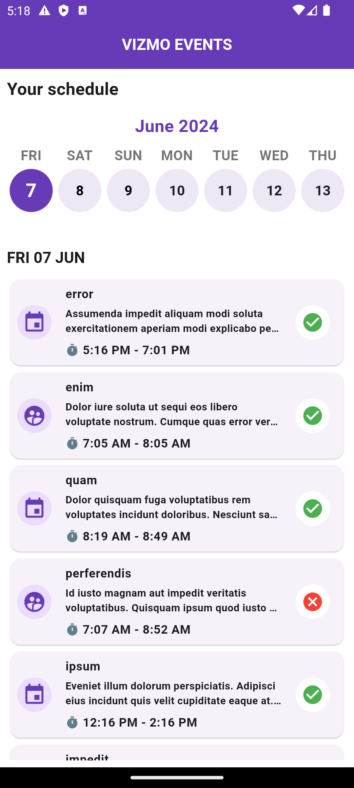
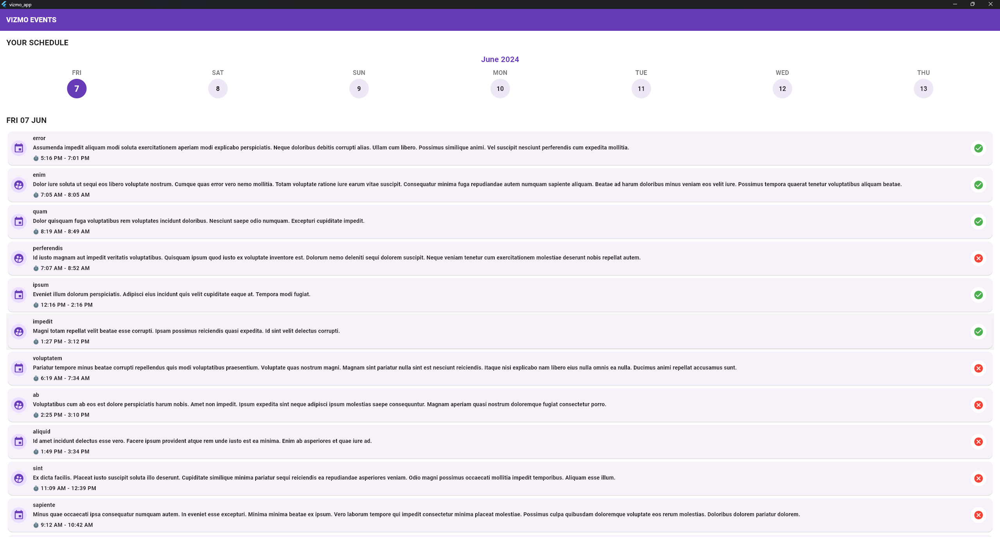

# VIZMO

## Getting Started

```dart
flutter pub get
```

## Technical Notes
 This repository uses the below 

 + Clean Architecture - [UseCase] & [Entities] has been removed. Modified as to complete the assessment within the due time.
 + Adheres to SOLID principles
 + BLOC State Management techniques
 + Uses HIVE Local Database - to dump API responses locally that are fetched during the first run intially.
 + The calendar has been manually jumped to Jun 2024 to avoid scrolling, aligned as per API's first response


## Screenshots  
 




 ## Packages 

+ dartz
+ dio
+ equatable
+ flutter_bloc
+ flutter_calendar_week
+ gap
+ get_it
+ hive
+ hive_flutter
+ intl
+ path_provider
+ flutter_svg

